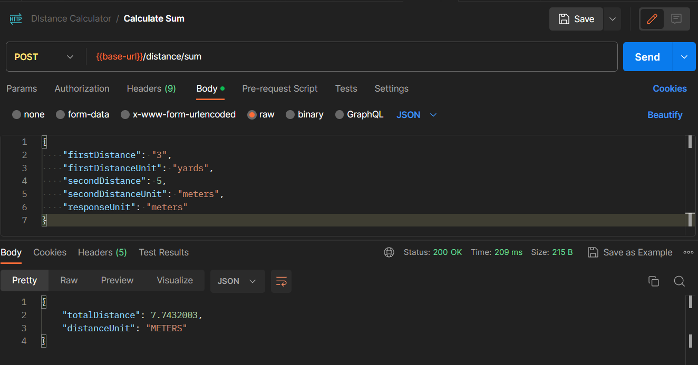
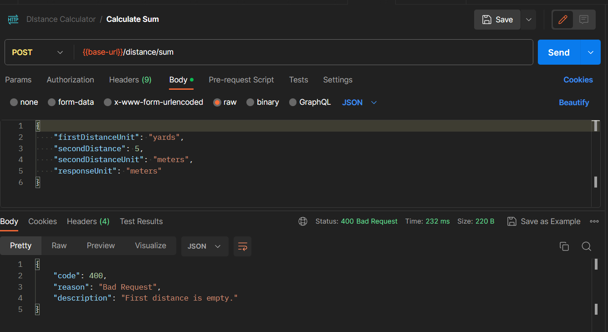

Distance Calculator
====================
Accepts in yard & meters and allow users to specify the response unit prefered

API URL - **POST** /distance/sum

Model
------
Request body:
- firstDistance
- firstDistanceUnit
- secondDistance
- secondDistanceUnit
- responseUnit

Response body:
- totalDistance
- distanceUnit

Distance Unit Enum
- yards
- meters

Controller
----------
Accepts & Validate request body
- Throw 400 Bad Request if unit is not Yard and Meters
- Throw 400 Bad Request if distance is not in numbers
- Return 200 OK with response body

Service
-------
1. Converts the distance to the response unit
2. Sum and return the distance

Further Improvements
======================
1. Add authorization checking, (JWT, Basic auth etc)
2. Add UI for this Rest Service
3. Improve code quality as in adding sonar scans
4. Allow users to do calculation with more metrics/ unit

Sample Response
================
200 Response

400 Response
